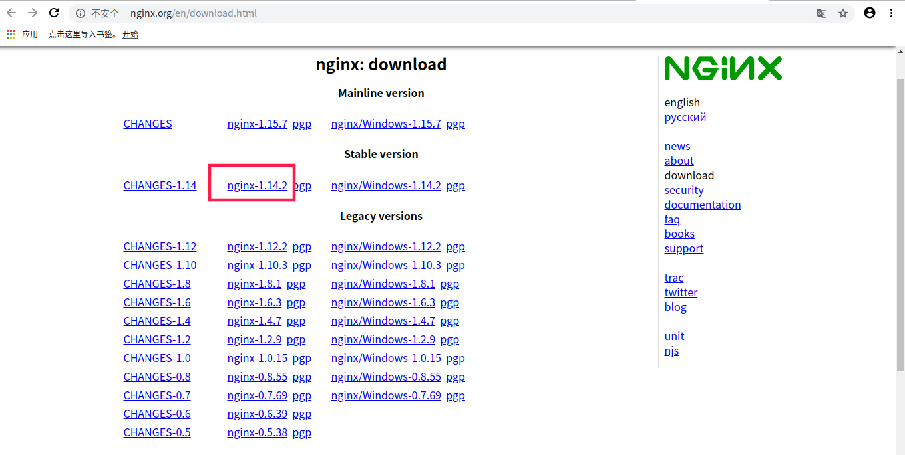
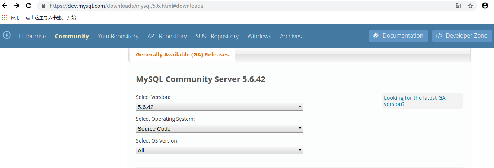
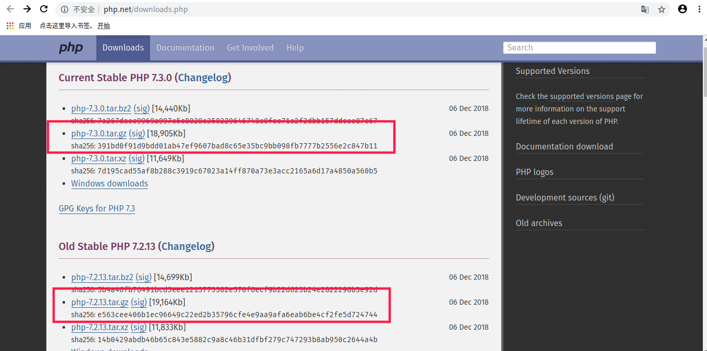

# lnmp 源码安装

- 安装前准备

  ```
  sudo apt-get install ntp make openssl openssl-devel pcre pcre-devel libpng libpng-devel libjpeg-6b libjpeg-devel-6b freetype freetype-devel gd gd-devel zlib zlib-devel gcc gcc-c++ libXpm libXpm-devel ncurses ncurses-devel libmcrypt libmcrypt-devel libxml2 libxml2-devel imake autoconf automake screen sysstat compat-libstdc++-33 curl curl-devel cmake
  ```

## 下载

- nginx: http://nginx.org/en/download.html

  

- mysql ： <http://dev.mysql.com/downloads/mysql/> ，下载Community Server版本的后缀为tar.gz的源码mysql-5.6.27.tar.gz：

  

  

- php：<http://php.net/downloads.php>  看自己的版本需要下载

  

## 安装

